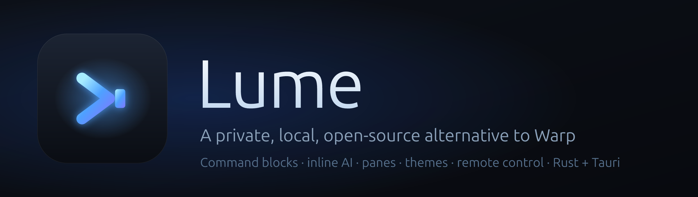
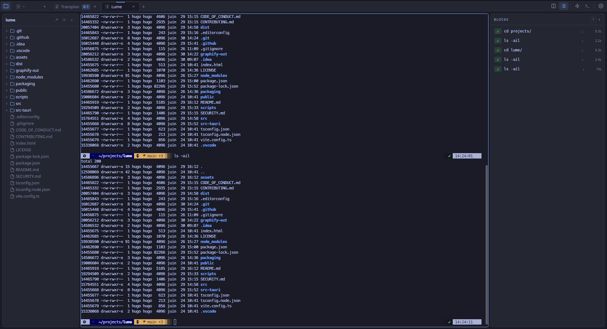
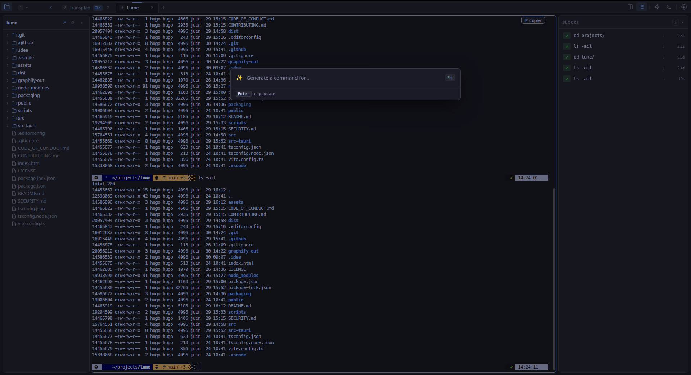
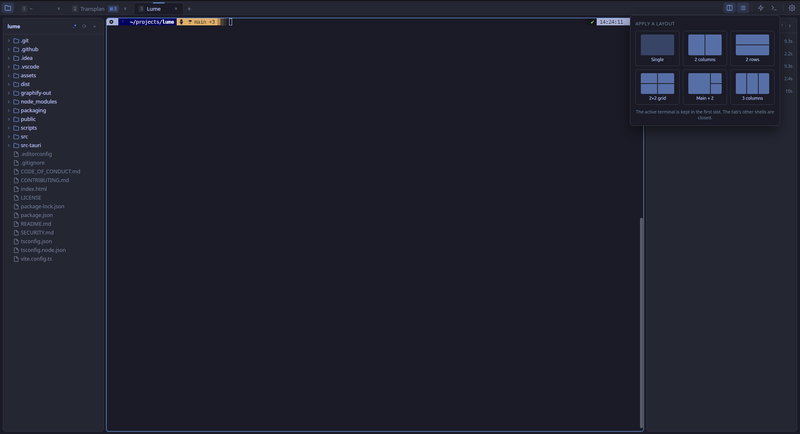
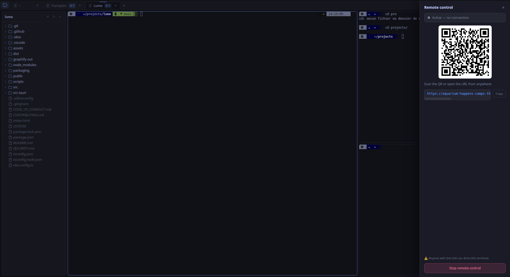

<p align="center">
  
</p>

<p align="center">
  <a href="https://github.com/hugomyb/Lume/releases/latest"></a>
  <a href="https://github.com/hugomyb/Lume/actions/workflows/ci.yml"></a>
  <a href="https://github.com/hugomyb/Lume/releases"></a>
  <a href="LICENSE"></a>
  <a href="https://github.com/hugomyb/Lume/stargazers"></a>
</p>

A fast, lightweight, **open-source alternative to Warp** — command blocks,
inline AI, panes, themes, remote control, and more. Built with
**Rust + Tauri 2 + SolidJS + xterm.js**: a few-MB native binary, **fully local,
no account, no telemetry**.

> **Platforms:** cross-platform by design (Tauri). **Linux** builds (X11 &
> Wayland) are shipping today; **macOS & Windows** are on the roadmap.

## Screenshots

> 📸 _Demo GIFs & screenshots land with the first stable release._

<!--
  To add them: drop images in assets/screenshots/ and replace the line above
  with this grid (uncomment):

<table>
  <tr>
    <td width="50%"><br><sub>Command blocks — each command + output is a navigable block</sub></td>
    <td width="50%"><br><sub>Inline AI — explain a block or generate a command</sub></td>
  </tr>
  <tr>
    <td><br><sub>Panes, tabs &amp; themes</sub></td>
    <td><br><sub>Remote control from your phone</sub></td>
  </tr>
</table>
-->

## Features

- **Command blocks** — each command + its output is an isolated, navigable block
  (via shell integration / OSC 133), with exit-code badges, copy, rerun.
- **Inline AI** — explain a block or generate a command from natural language.
  Multiple providers: the local **Claude** or **Codex** CLI, or any
  **OpenAI-compatible API** (OpenAI, DeepSeek, Ollama…). Pick per provider model.
- **Panes & tabs** — splits, drag-and-drop rearrange, layout presets, full
  session persistence (tabs, panes, sizes, working dirs).
- **Autocomplete** — inline suggestions from history, files, aliases, commands.
- **File tree sidebar** that follows the active pane's directory, with
  customizable right-click commands.
- **Remote control** — drive your terminals from your phone or another PC, on the
  LAN or over the internet (cloudflared quick tunnel), with QR pairing. The mobile
  page has a Termux-style key row, live directory completion, swipe-to-move-cursor,
  and a tab bar to switch/create terminals.
- **Themes & fonts** — 9 built-in themes, custom font import, Nerd Font support,
  remappable keybindings, text zoom.
- **14 languages** — fully translated UI, switchable in settings (English default).
- **Desktop notifications** when long commands finish in the background.
- **Self-updating** (AppImage) with signed updates.

## Install (Linux x86_64)

### AppImage (any distro, auto-updating) — recommended
```bash
curl -fsSL https://raw.githubusercontent.com/hugomyb/Lume/main/scripts/install.sh | bash
```
This installs the latest AppImage and adds a menu entry. If it doesn't launch,
install FUSE 2: `sudo apt install -y libfuse2`.

### Debian / Ubuntu
Download `Lume_*_amd64.deb` from the [latest release](https://github.com/hugomyb/Lume/releases/latest):
```bash
sudo apt install ./Lume_*_amd64.deb
```

### Fedora / RHEL / openSUSE
```bash
sudo dnf install ./Lume-*.x86_64.rpm
```

### Arch / Manjaro (AUR)
```bash
yay -S lume-bin       # or: paru -S lume-bin
```

## Shell integration

For command blocks, autocomplete and cwd tracking, add this to your shell rc
(Lume shows the exact line on first launch; the script is written to
`~/.config/lume/`):

```bash
# ~/.zshrc  (or .bashrc / fish config.fish)
[[ -n "$LUME_TERM" ]] && source "$HOME/.config/lume/lume-shell-init.zsh"
```

## Build from source

Requirements: Rust (stable), Node 20+, and the Tauri Linux deps:

```bash
sudo apt install -y libwebkit2gtk-4.1-dev libgtk-3-dev librsvg2-dev \
  libayatana-appindicator3-dev libxdo-dev patchelf

npm install
npm run tauri dev      # run in dev
npm run tauri build    # build bundles (target/release/bundle/)
```

## Contributing

Contributions are welcome! See [CONTRIBUTING.md](CONTRIBUTING.md) for how to set
up, build, run the checks, and open a pull request. By participating you agree to
the [Code of Conduct](CODE_OF_CONDUCT.md).

## Security

Found a vulnerability? Please report it privately — see [SECURITY.md](SECURITY.md).
Do not open a public issue for security problems.

## License

[MIT](LICENSE) © Hugo Mayonobe
